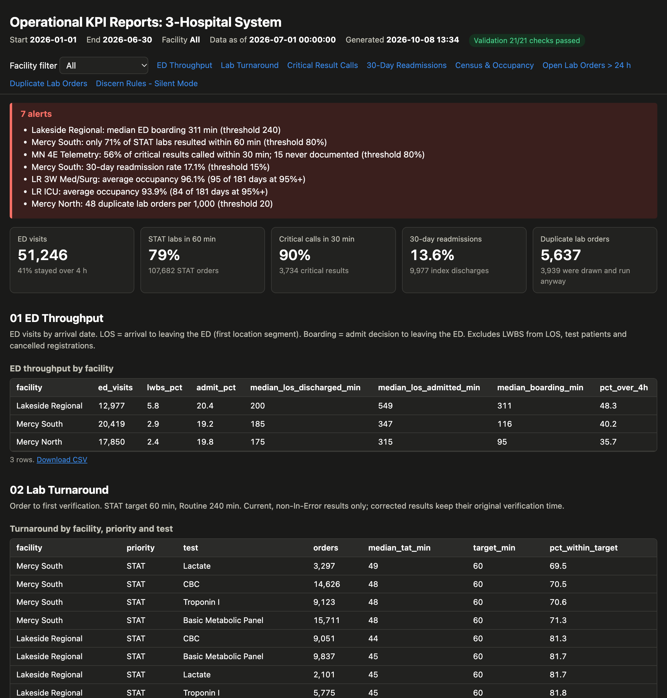
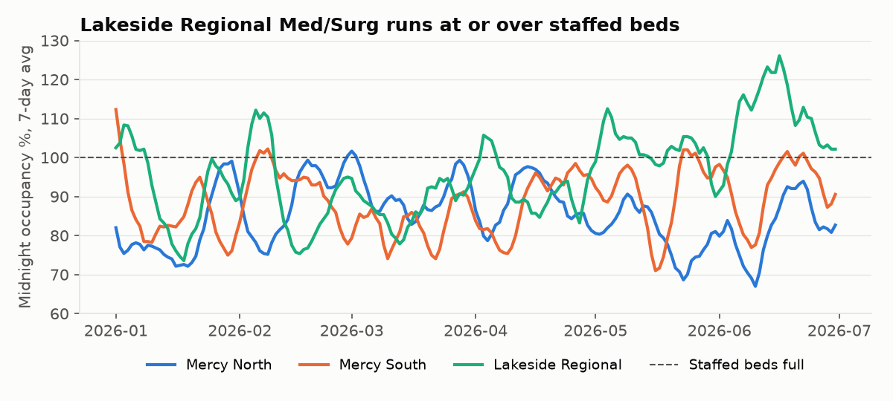
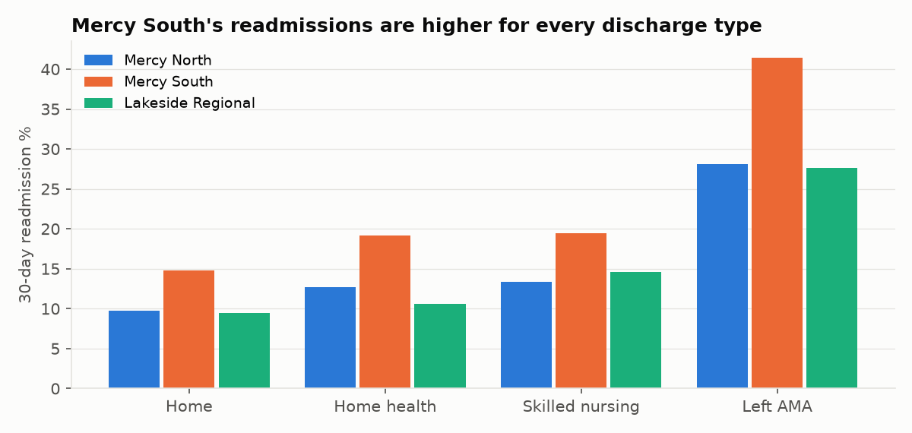
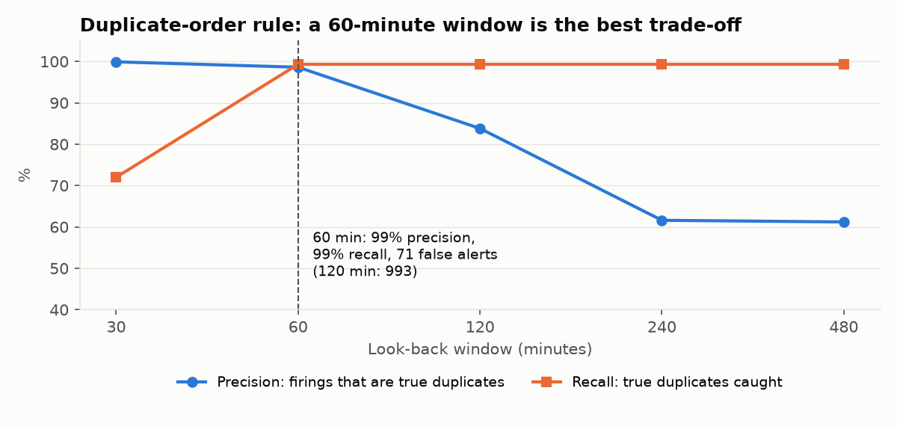

# Clinical Operations Reporting on a Millennium-Style Schema

SQL · Oracle · CCL · HTML · Python

I built this project to get hands-on with the kind of reporting work a Cerner reporting analyst does every day: understanding the Millennium data model, writing KPI and operational reports, publishing them in a form people actually use, validating the numbers, and tracking down problems when the numbers look wrong.

The scenario is a three-hospital system (Mercy North, Mercy South and Lakeside Regional) with six months of activity. The question I set out to answer for the operations team:

> Where are the throughput and patient-safety gaps in the ED, the lab and on the nursing units, and which reports and alerts should leaders see every morning?



*The published report page (`output/reports.html`). It has prompt values at the top, a validation badge, threshold alerts, KPI tiles, a facility filter, sortable tables and a CSV download for every query.*

## What's in here

- **Data model.** 13 tables named and structured after Millennium: ENCOUNTER, ENCNTR_LOC_HIST, ORDERS, ORDER_DETAIL, a versioned CLINICAL_EVENT, CODE_VALUE and others. They hold six months of synthetic data: 72K encounters, 227K orders and 414K result rows.
- **Seven reports in SQL**, with date and facility prompts the way a CCL program takes them: ED throughput, lab turnaround, critical result calls, 30-day readmissions, midnight census, open lab orders and duplicate lab orders.
- **The same reports in CCL**, plus an MPage data driver and a program for a Discern rule's logic.
- **HTML output.** A report page with alerts, and a small MPage component that reads the JSON the CCL driver returns.
- **Two Discern rules** (duplicate lab orders, and critical-result escalation), run against history in silent mode to see how they would behave before go-live.
- **An Oracle version** of reports 01–05, reconciled value for value against the SQLite output.
- **Validation and testing**: 21 pre-publish checks and 19 automated tests. I also wrote up two root-cause analyses, a performance-tuning log, and a release runbook.

## What the reports show

These are the numbers from the January–June 2026 run.

| Area | What I found | What I'd recommend |
|---|---|---|
| ED boarding | Admitted patients at Lakeside Regional wait a median of 311 minutes for a bed, and spend 9.2 hours in the ED overall, against 5.2–5.8 hours at the other two hospitals. Lakeside's Med/Surg unit averages 96% occupancy and was at 95% or above on 95 of 181 days. | A bed-flow review at Lakeside: earlier discharges, and using the transfer center to move patients to the sister hospitals. |
| Lab turnaround | Mercy South results 71% of STAT labs within 60 minutes; the other two are at 82–87%. Almost all of the gap is on nights: 44% at night versus 86% during the day. | Look at night-shift lab staffing and courier coverage at Mercy South. |
| Critical results | Mercy North 4E Telemetry calls only 56% of critical results to a provider within 30 minutes. Every other unit is between 83% and 95%. Fifteen calls were never documented. | Send the daily critical-result worklist to the unit manager, and turn on the escalation rule. |
| Readmissions | Mercy South's 30-day readmission rate is 17.1%, compared with 11.0–11.4%. It's higher for every discharge disposition. | Case management focus on patients discharged to skilled nursing or leaving against medical advice. |
| Duplicate orders | Mercy North has 48 duplicate lab orders per 1,000, about three times the others. 2,408 of those duplicates were actually drawn and run. | A duplicate-order Discern rule with a 60-minute window (details below). |
| Open orders | 193 lab orders were still open more than 24 hours after being placed, and 186 of them belong to patients who had already gone home. | A daily worklist for the lab supervisor, run as an ops job. |


<details>
<summary>More charts</summary>




</details>

## Things worth calling out

**Two report bugs and how I tracked them down.** The first version of the ED report filtered on encounter type = Emergency. Millennium converts an admitted ED patient's encounter to Inpatient, so that filter quietly dropped about one in five ED visits, and they were the longest ones. The first lab turnaround report joined every row of CLINICAL_EVENT. Corrected results have more than one row, so lab volume came out 1.74 times too high. Both are written up in [docs/rca.md](docs/rca.md), and the broken versions are kept in `sql/archive/` so the difference can be reproduced.

**The duplicate-order rule.** The rule was requested with a 120-minute look-back. Before turning it on, I replayed six months of orders through it in silent mode. At 120 minutes it would have fired on 993 orders that were intended repeats, such as a repeat lactate for sepsis or a potassium recheck. At 60 minutes it catches the same real duplicates with only 71 false alerts. See [docs/discern_rules.md](docs/discern_rules.md).

**Tuning.** One census report took 2.9 seconds. The logic was fine, but the explain plan showed the database using a near-useless index on `active_ind`. Steering it to the right index brought the report down to 0.08 seconds. That fix and two others are in [docs/performance_tuning.md](docs/performance_tuning.md).

**Checking against Oracle.** Millennium runs on Oracle, so I ported reports 01–05 and compared every value with the SQLite output. The first comparison didn't match, and it turned up a real bug: SQLite sorts NULLs first, which shifted the median in my critical-results report. With that fixed, all 238 values match. See [oracle/README.md](oracle/README.md).

## About the data and the CCL

- **All of the data is synthetic.** I wrote a generator (`src/generate_data.py`, fixed seed) that produces realistic volumes. There are no real patients, staff or facilities.
- **I built the problems in on purpose.** I gave each hospital a few deliberate issues (Lakeside's boarding, Mercy South's night-shift lab delays, and so on) so the reports had something real to find. The test is whether the reports pick them up correctly. The generator also adds test patients, cancelled registrations, corrected results and results marked In Error, so every exclusion rule gets exercised.
- **The SQL and Oracle versions run and are tested. The CCL has not been compiled yet**, because I don't have access to a Millennium domain. I wrote it to Cerner conventions and kept it line-for-line with the tested SQL; I'd expect to fix a few syntax details on the first compile. More in [ccl/README.md](ccl/README.md).
- The schema is a simplified slice of Millennium. The real tables have far more columns, and things like the `CE_*` child tables, ORDER_CATALOG and the LOCATION hierarchy are left out.

## Repository layout

```
sql/schema.sql         Millennium-style tables and indexes
sql/reports/           the reports (13 named queries across 8 files)
sql/dq_checks.sql      data-quality checks run before publishing
sql/archive/           the two defective queries from the RCA
src/                   data generator, report runner, validation, rules, HTML build, charts, RCA and tuning scripts
ccl/                   CCL versions of the reports, MPage driver, rule logic
mpage/                 HTML/JS MPage component
oracle/                Oracle DDL, Oracle reports, load + reconciliation script
rules/                 Discern rule definitions
tests/                 pytest suite
output/                published report page, CSVs, validation and reconciliation results
docs/                  data model, report specs, RCA, tuning, rules, test plan, release runbook
```

## Running it

```bash
python3 -m venv venv && source venv/bin/activate
pip install -r requirements.txt
./run_all.sh
```

`run_all.sh` generates the data and runs the rules, then validation. If any check fails it stops there, before publishing. Otherwise it builds the report page and charts, reproduces the RCA and tuning numbers, and runs the tests. The whole run takes about a minute. The SQLite database is around 200 MB, so it isn't committed; the script rebuilds it.

To run a single report with different prompt values:

```bash
python src/report_runner.py --start 2026-04-01 --end 2026-06-30 --facility "Mercy South"
```

The Oracle steps are in [oracle/README.md](oracle/README.md). They need Docker.

## Documentation

- **[Case study](docs/case_study.md)**: the whole project start to finish: objective, approach, problems I hit and how I fixed them, results and lessons ([PDF](docs/case_study.pdf))
- [Data model](docs/data_model.md): the tables, code sets, and the rules every report follows
- [Report specifications](docs/report_specs.md): what each report answers and how it's calculated
- [Root-cause analysis](docs/rca.md): the two report bugs
- [Performance tuning](docs/performance_tuning.md)
- [Discern rules](docs/discern_rules.md): silent-mode results and the window decision
- [Test plan](docs/test_plan.md): what's checked and the results
- [Release runbook](docs/release_runbook.md): how a report moves from request to production

## What I'd do next

- Compile and run the CCL in a real domain, and build one report as a Discern Explorer layout.
- Port reports 06–08 to Oracle.
- Risk-adjust the readmission rate and exclude planned readmissions, as the CMS measure does.
- Add a set of business-friendly views over the base tables, similar to a BusinessObjects universe.
