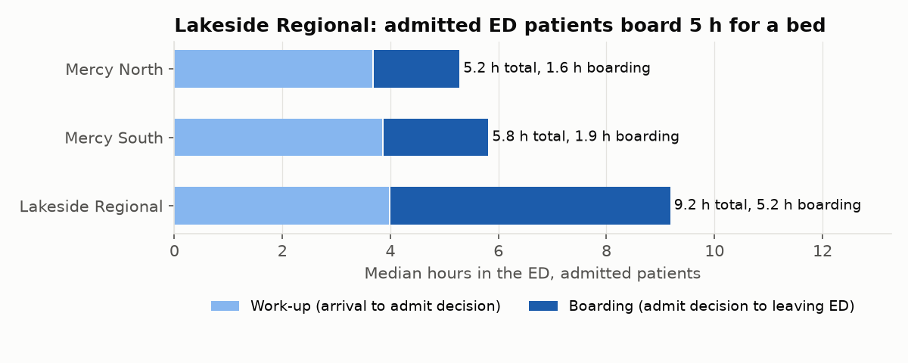
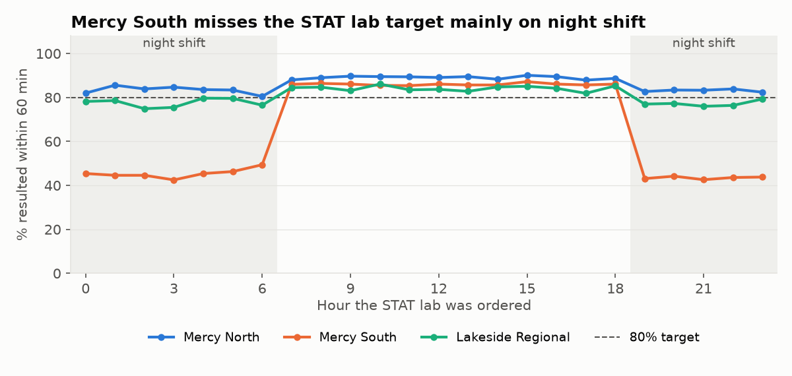
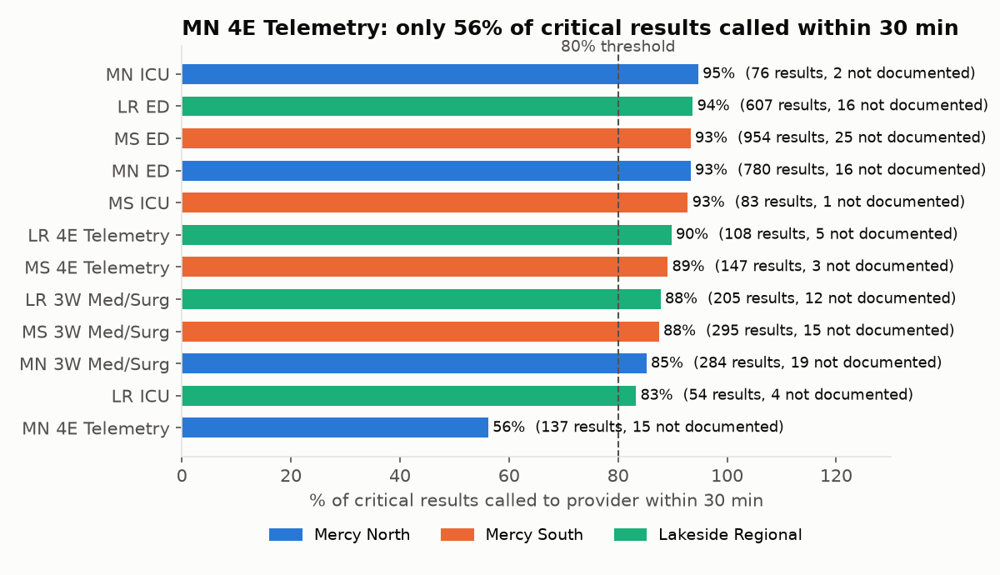

# Case Study: Building Clinical Operations Reports on a Cerner Millennium-Style Data Model

**Naveen Kumar Kovi** · SQL · Oracle · CCL · HTML · Python
Code and full documentation: [github.com/kovinaveenkumar/millennium-clinical-reporting](https://github.com/kovinaveenkumar/millennium-clinical-reporting)

---

## Summary

I built a complete clinical reporting project end to end:

- a data model that mirrors Cerner Millennium's core tables
- six months of synthetic data for three hospitals
- seven operational reports, written in SQL and in CCL
- an HTML report page and an MPage component
- two Discern rules, tested before go-live
- a validation suite that has to pass before anything gets published

I ported the main reports to Oracle and checked every number against the original.

Along the way I hit, investigated and fixed several real problems. Two report bugs came from misreading how Millennium stores data. There was also a slow query caused by a bad execution plan, and a median calculation that only failed on one database. Those problems taught me more than the parts that worked first time, so this document covers them in detail.

| At a glance | |
|---|---|
| **Data** | 13 Millennium-style tables · 72K encounters · 227K orders · 414K result rows |
| **Reports** | 7 reports (13 queries) with date and facility prompts, in SQL and CCL |
| **Quality** | 21 pre-publish checks · 19 automated tests · 238 of 238 values matched on Oracle |
| **Bugs found and fixed** | 2 report logic errors · 1 bad query plan (2.9 s to 0.08 s) · 2 cross-database differences |

---

## 1. Why I built this

Clinical reporting analysts who work with Cerner spend their days on:

- the Millennium data model
- CCL programs and SQL
- KPI and operational reports
- Discern rules
- troubleshooting numbers that don't look right

I wanted hands-on practice with all of it, not just reading about the tables. There's no public Millennium environment, so I built a realistic stand-in and treated it like a real assignment: a business question, requesters with real needs, reports that had to be right, and evidence that they were.

## 2. The scenario and the objective

The setting is a three-hospital system: Mercy North, Mercy South and Lakeside Regional. Operations leadership wanted one question answered:

> **Where are the throughput and patient-safety gaps in the ED, the lab and on the nursing units, and which reports and alerts should leaders see every morning?**

That broke down into specific requests from different people:

| Requester | What they asked for |
|---|---|
| ED operations director | How long do patients spend in the ED, and how much of that is waiting for a bed? |
| Laboratory director | Are STAT labs back within 60 minutes? When do we miss? Why does our order volume look wrong? |
| Nursing leadership / patient safety | Are critical lab values called to a provider within 30 minutes? Which units are behind? |
| Quality and case management | Which hospital has the highest 30-day readmission rate, and for which patients? |
| House supervisor | How full is each unit at midnight, compared with staffed beds? |
| Lab supervisor | Which lab orders have been sitting open for more than a day? |
| Clinical informatics | How many duplicate lab orders are we placing, and would a Discern rule help? |

## 3. How I approached it

I worked in the same order I would on a real team:

1. **Learn the data model** and build a schema that behaves like Millennium.
2. **Generate realistic data**, including the messy parts real data has.
3. **Write a spec** for each report before writing any code.
4. **Build the reports in SQL**, then write the CCL versions.
5. **Publish** them as an HTML page and an MPage component.
6. **Validate** with data-quality checks, control totals and tests.
7. **Investigate anything that looked wrong** and write it up.
8. **Tune** the slow queries.
9. **Test the Discern rules** in silent mode.
10. **Port to Oracle** and reconcile.

## 4. The data model

I built 13 tables using Millennium's names and structure, so the SQL reads the way it would against a real domain:

| Area | Tables |
|---|---|
| Patients | PERSON, PERSON_ALIAS (MRN) |
| Visits | ENCOUNTER, ENCNTR_ALIAS (FIN), ENCNTR_LOC_HIST |
| Orders | ORDERS, ORDER_DETAIL, ORDER_ACTION |
| Results | CLINICAL_EVENT |
| Staff | PRSNL |
| Codes | CODE_VALUE, CODE_VALUE_SET |
| Rules | EKS_MODULE_AUDIT |

I also added one custom table for staffed beds.

The most useful part of this phase was learning the quirks that make Millennium reporting tricky. I ended up writing them down as rules every report follows:

- **Results are versioned.** A corrected result doesn't overwrite the old one. The old row gets an end date, and a new row is added with the same `event_id`. Reports must only use the current version.
- **Admitted ED patients change encounter type.** When someone is admitted from the ED, their encounter type changes from Emergency to Inpatient on the same encounter.
- **Lab priority isn't on the ORDERS table.** It's an order-entry field in ORDER_DETAIL.
- **Location history decides where a patient was.** ENCOUNTER only stores the last unit. ENCNTR_LOC_HIST has every move with start and end times.
- **Codes must be looked up by meaning, never by number.** The numeric code values differ between domains.
- **Test patients and cancelled registrations live in the same tables as real data**, and have to be filtered out every time.

## 5. Generating realistic data

I wrote a Python generator that simulates six months of hospital activity:

- ED arrivals by hour and weekday
- admissions and transfers between units
- daily morning labs for inpatients
- STAT labs in the ED
- results with normal, abnormal and critical values
- nurses documenting critical-result calls
- discharges and readmissions

To give the reports something to find, I built a few problems in on purpose:

- Lakeside Regional is short on inpatient beds, so admitted ED patients board longer.
- Mercy South's lab is slow on night shift, and its readmission rate is higher.
- Mercy North places more duplicate lab orders, and one of its telemetry units is slow to call critical results.

I also added the messy parts: test patients, cancelled registrations, corrected results and results marked In Error.

**What I had to fix in the data itself.** My first few versions were unrealistic in ways the reports exposed:

- **The duplicate-order rule scored 100% precision.** Real hospitals have intended repeat orders: a repeat lactate for sepsis, a potassium recheck, serial troponins. Without them there was no trade-off to analyse, so I added them.
- **Mercy South's night-shift STAT rate came out around 16%.** That's far too extreme to be believable, so I recalibrated it to roughly 44%.
- **The open-orders worklist listed over 1,200 orders that had been open for months.** Real systems cancel uncollected lab orders when the patient is discharged, so I added that behaviour. The worklist dropped to 193 orders, a realistic number someone could actually work through.

## 6. The reports

Each report has a written spec covering who asked, what it answers, how every number is calculated, and what triggers an alert. Every report takes the same prompts: start date, end date, and facility (or all facilities).

| # | Report | Key measures |
|---|---|---|
| 01 | ED throughput | Visits, left-without-being-seen rate, median time in ED, median boarding time, % over 4 hours |
| 02 | Lab turnaround | Order-to-result time by facility, priority and test, % within target, STAT by hour of day |
| 03 | Critical result calls | % called within 30 min by unit, plus a worklist of late or undocumented calls |
| 04 | 30-day readmissions | Rate by facility and by discharge disposition |
| 05 | Midnight census | Daily census and occupancy against staffed beds |
| 06 | Open lab orders | Orders open over 24 hours, with a suggested next step |
| 07 | Duplicate lab orders | Duplicates per 1,000 orders, and how many were drawn anyway |

Some of the SQL techniques that came up:

- window functions to calculate medians
- a recursive CTE to generate the list of census days
- point-in-time joins to find which unit a patient was on when a result came back
- correlated `EXISTS` for readmissions
- self-joins for duplicate orders

## 7. Publishing: HTML page and MPage

**The report page.** A Python script runs every query and builds one self-contained HTML page. It has:

- the prompt values, and a badge showing whether validation passed
- an alert banner that fires when a KPI crosses its threshold
- KPI tiles
- a facility filter and sortable tables
- a CSV download for every query

**The MPage component.** In PowerChart it would call a CCL program through `XMLCclRequest`, and the program returns JSON using `cnvtrectojson`. Outside Millennium it reads a JSON file with exactly the same structure, so I could build and test the page without a domain.

## 8. The CCL versions

I wrote every report as a CCL program, plus the MPage data driver and a program a Discern rule can call for its logic. They follow standard conventions:

- a header with a mod log
- prompts
- code values looked up once with `uar_get_code_by`
- `parser()` for optional filters
- record structures with head/detail/foot processing
- `outerjoin()` where a row may not exist

I'm upfront about one thing: **these haven't been compiled yet**, because I don't have access to a Millennium domain. I kept each one line-for-line with its SQL version, which is run and tested, and I expect to fix some syntax details on first compile.

## 9. Validation and testing

Nothing gets published unless validation passes. The pipeline stops on the first failure.

**21 pre-publish checks.** 14 data-quality checks and 7 control totals:

- **Data quality:** orphan records, discharges before registration, overlapping locations, results with more than one current version, codes that don't resolve, missing order priorities, and others.
- **Control totals:**
    - report totals must match independent counts
    - the three facilities must add up to the all-facilities total
    - no test patient may appear on any worklist

**19 automated tests.** The most valuable ones recalculate each report independently in pandas and compare every value with the SQL output. A logic error would have to be made twice, in two languages, to get through. Other tests check:

- prompt behaviour: six monthly runs add up to the six-month run, and a misspelled facility is rejected
- that neither of the two bugs below can come back

## 10. Problems I found and how I fixed them

### Bug 1: the ED report was missing one in five visits

The first version showed 41,289 ED visits; the true number was 51,246. It also put "over 4 hours" at 24–32% when the real figure was 36–48%.

When I compared the report with a raw count of ED arrivals, the gap was 19%. I pulled ten of the missing visits by FIN, and every one was an Inpatient encounter whose location history started in the ED. The cause was my filter on encounter type = Emergency. Admitted patients are converted to Inpatient on the same encounter, so the filter dropped exactly the patients with the longest stays.

**Fix:** count ED visits by ED arrival time, and measure the stay from the location history.

**Prevention:** a control total, a regression test, and a written rule for every report.

### Bug 2: the lab report counted corrected results twice

The lab report showed 1.74 times more STAT volume than the lab system. I found four problems in one query:

- It used every version of every result. That brought in 6,436 superseded rows and 1,563 results marked In Error.
- It measured turnaround to the correction's verification time instead of the original result. Corrections were verified a median of 19 hours later.
- It counted individual results rather than orders.

**Fix:** one row per order. Measure to the first verification, and only include orders that still have a valid current result.

### A slow report caused by a bad plan

The census summary took 2.9 seconds, while a nearly identical query took under a tenth of a second. The query plan showed the database building an index on `active_ind`, a column where almost every row has the same value, and using it for every unit on every day. Once I steered the database to the right index, the report ran in 0.08 seconds, about 37 times faster.

I also:

- removed a function wrapped around an indexed date column (8 times faster)
- rewrote the daily census as a single pass instead of rescanning history for every day (4 times faster, with output proven identical)

### Two differences that only showed up on Oracle

Porting to Oracle and comparing every value turned up two more issues that my own tests had missed:

- **A median bug.** SQLite sorts NULLs first. In the critical-results report, a NULL means a call that was never documented. Those rows took the first positions and pushed my hand-built median too low: 20 minutes instead of 25 on the telemetry unit. Oracle's `MEDIAN()` ignores NULLs, so it had the right answer. I fixed the sort order and added a test for that column.
- **A rounding difference at exactly 60 minutes.** One lab order came back at exactly 60:00. Floating-point math in SQLite counted it as on time, while Oracle's decimal date math didn't. I changed both versions to measure from whole seconds.

After those fixes, all 238 values match between the two databases.

## 11. Testing the Discern rules before go-live

The lab committee asked for a duplicate-order rule with a 120-minute look-back. Instead of switching it on, I replayed six months of orders through it in silent mode. Every firing was logged to the audit table and nobody was alerted. Then I compared the firings with the orders I knew were genuine duplicates.

| Window | Firings | Real duplicates caught | False alerts | Precision |
|---|---|---|---|---|
| 30 min | 3,737 | 72% | 2 | 99.9% |
| **60 min** | **5,221** | **99.3%** | **71** | **98.6%** |
| 120 min (requested) | 6,143 | 99.3% | 993 | 83.8% |
| 240 min | 8,364 | 99.3% | 3,214 | 61.6% |

At 120 minutes the rule would have fired on 993 intended repeats, such as sepsis lactates and potassium rechecks. That's exactly how alert fatigue starts. At 60 minutes it catches the same real duplicates with 71 false alerts.

**I recommended going live at 60 minutes**, first at Mercy North, which has three times the duplicate rate. The rule would stay in silent mode for two more weeks in production, with weekly reviews.

I also tested a second rule that escalates critical results not called within 30 minutes. It would fire about two to three times a day across the system, a manageable load.

## 12. What the reports found

| Area | Finding | Recommendation |
|---|---|---|
| ED boarding | Lakeside Regional's admitted patients wait a median of **311 minutes** for a bed and spend **9.2 hours** in the ED, against 5.2–5.8 hours elsewhere. Its Med/Surg unit averages **96% occupancy**. | A bed-flow review: earlier discharges, and transfers to the sister hospitals |
| Lab turnaround | Mercy South results **71%** of STAT labs within 60 minutes, against 82–87% elsewhere. Nights are **44%**, days are **86%**. | Review night-shift lab staffing and courier coverage |
| Critical results | Mercy North 4E Telemetry calls **56%** of critical results within 30 minutes. Every other unit is at 83–95%. | Daily worklist to the unit manager, and turn on the escalation rule |
| Readmissions | Mercy South is at **17.1%**, against about 11%, and it's higher for every type of discharge | Case management focus on skilled-nursing and against-medical-advice discharges |
| Duplicate orders | Mercy North has **48 per 1,000** orders, three times the others. **2,408** duplicates were drawn and run. | Duplicate-order rule with a 60-minute window |
| Open orders | **193** lab orders were open over 24 hours, and **186** belonged to patients already discharged | Daily worklist for the lab supervisor |

## 13. What I learned

- **Most reporting errors are data-model errors, not math errors.** Both of my report bugs came from not knowing how Millennium stores something. Learning the data model is most of the job.
- **A number isn't done until it's been reconciled.** Every bug I found was caught by comparing a total with something independent: a raw count, a second calculation, or a second database.
- **Read the query plan.** The slowest report had nothing wrong with its logic.
- **Test rules on history before anyone sees an alert.** Silent mode turned a judgement call about the window into a measured decision.
- **Write it down.** Specs, root-cause write-ups and a release runbook make the work easy to review and hand over.

## 14. Limitations and next steps

- The data is synthetic, and the problems in it were planted on purpose.
- The CCL hasn't been compiled. That's the first thing I'd do with access to a domain, along with building one report as a Discern Explorer layout.
- The schema is a simplified slice of Millennium.
- The readmission rate isn't risk-adjusted and doesn't exclude planned readmissions, as the CMS measure does.
- Reports 06–08 haven't been ported to Oracle yet.

---

*The full code, report specs, root-cause write-ups, test plan and release runbook are on GitHub: [github.com/kovinaveenkumar/millennium-clinical-reporting](https://github.com/kovinaveenkumar/millennium-clinical-reporting)*
