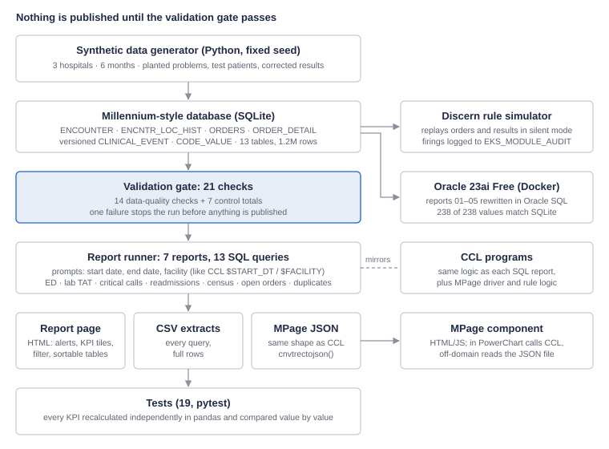
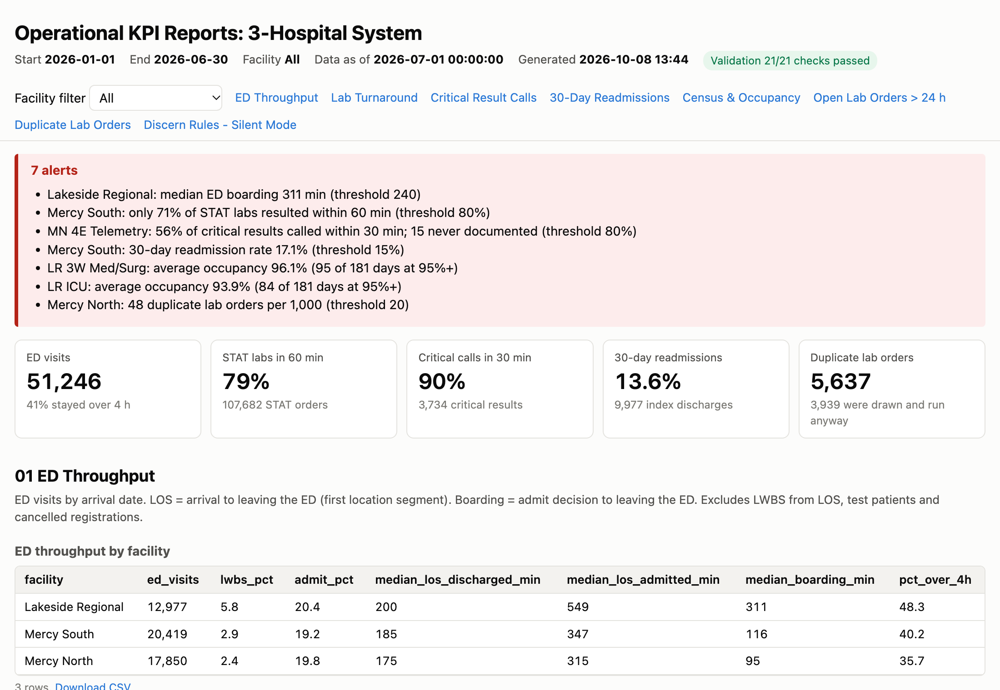

# Clinical Operations Reporting on a Millennium-Style Data Model

<p class="byline">Naveen Kumar Kovi<br>github.com/kovinaveenkumar/millennium-clinical-reporting</p>

## Abstract

I built a clinical reporting system for a three-hospital network on a data model that mirrors Cerner Millennium. It produces seven operational and KPI reports, and every reported value was checked against an independent calculation.

The system holds six months of synthetic hospital activity: 72,000 encounters, 227,000 orders and 414,000 result rows across 13 Millennium-style tables. Every report takes the same prompts a CCL program would (date range and facility). Each one is written twice, in SQL that runs and is tested, and in CCL. The results are published as an HTML report page with threshold alerts, and as JSON for an MPage component.

Nothing is published unless 21 data-quality checks and control totals pass. A further 19 automated tests recalculate every KPI separately in pandas and compare the results value by value. I ported the main reports to Oracle and reconciled all 238 values against the original. That comparison caught a median bug my own tests had missed.

The reports surfaced a 5-hour ED boarding problem, a night-shift lab delay and a telemetry unit that called only 56% of critical results on time. Before go-live, I tested a duplicate-order Discern rule against six months of history in silent mode. A 60-minute look-back caught the same real duplicates as the requested 120 minutes, with 71 false alerts instead of 993.

Code: [github.com/kovinaveenkumar/millennium-clinical-reporting](https://github.com/kovinaveenkumar/millennium-clinical-reporting).

<div class="pb"></div>

## 1. Problem and motivation

Hospital operations leaders make daily decisions from reports. A wrong number does more harm than a missing one, because people act on it. In Cerner Millennium environments those reports are built in CCL and SQL on top of a data model with several traps. Data stored in ways that look intuitive often isn't what it seems. A report can run cleanly and still be wrong.

Three things make this work harder than it looks:

1. **The data model.** Results are versioned, so a corrected lab value exists as more than one row. An ED patient who is admitted gets a different encounter type on the same visit. Test patients and cancelled registrations sit alongside real ones. A query that ignores any of these returns the wrong answer, and nothing crashes.
2. **Trust.** A report is only useful if its users believe it. One visible error and a manager goes back to counting by hand.
3. **Alert fatigue.** A Discern rule that fires too often trains clinicians to click through it, which is worse than no rule at all.

I wanted hands-on practice with the full reporting cycle a Cerner reporting analyst owns: learning the data model, writing KPI and operational reports, publishing them, validating the numbers, troubleshooting when they look wrong, and documenting everything. There is no public Millennium environment, so I built a realistic stand-in and treated it like a real assignment.

<div class="pb"></div>

## 2. Goals and success criteria

I set measurable targets before building, so the testing would check the design rather than justify it afterwards.

| Goal | How measured | Target | Result |
|---|---|---|---|
| Correct numbers | Every KPI recalculated independently in pandas | All values match | All match (19 tests) |
| Nothing wrong gets published | Data-quality checks and control totals before publishing | Run stops on any failure | 21 of 21 pass; the pipeline stops on a failure |
| Works on Millennium's database | Reports ported to Oracle and compared value by value | All values match | 238 of 238 match |
| Usable by operations | One page with alerts, filters and downloads | Every report on one page | 13 queries, 7 alerts, CSV for each |
| Fast enough to schedule | Run time of the slowest report | Under 1 second | 0.08 s after tuning (was 2.9 s) |
| Safe rule go-live | Silent-mode replay of six months of orders | Precision above 95% | 98.6% at a 60-minute window |
| Reproducible | Same data and results on any machine | Fixed seed, one command | `./run_all.sh` in about 1 minute |

<div class="pb"></div>

## 3. System architecture

Data flows from the generator into the database. It then passes a validation gate before any report runs, so a data problem stops the run instead of reaching a manager.



The report runner binds the prompt values and runs all 13 queries. Its output goes to three places: the HTML report page, CSV files and the MPage JSON.

Three side tracks reuse the same database:
- the Discern rule simulator, which replays history through the rules
- the Oracle port, which reruns the reports on Oracle and compares every value
- the CCL programs, which mirror each SQL report line for line

<div class="pb"></div>

## 4. Data: schema and synthetic dataset

The schema uses Millennium's table and column names, so the SQL reads exactly as it would against a real domain. It covers six months, January to June 2026, with a two-week warm-up in December so the census and readmission look-backs aren't empty on day one.

| Table | Rows | What it holds |
|---|---|---|
| PERSON, PERSON_ALIAS | 61,721 each | Patients and their MRNs |
| ENCOUNTER, ENCNTR_ALIAS | 71,729 each | Visits (ED, inpatient, outpatient) and their FINs |
| ENCNTR_LOC_HIST | 83,789 | Every move between ED and nursing units, with start and end times |
| ORDERS, ORDER_DETAIL | 227,209 each | Lab orders, and their priority (an order-entry field) |
| ORDER_ACTION | 454,194 | Order, complete and cancel actions |
| CLINICAL_EVENT | 413,601 | Versioned lab results and nursing documentation |
| CODE_VALUE, CODE_VALUE_SET | 63 / 15 | Every coded value, by code set |
| PRSNL, CUST_UNIT_CAPACITY | 480 / 9 | Staff, and staffed beds per unit |

**Why synthetic data.** Real patient data can't be published, and no public dataset has Millennium's structure. I wrote a generator with a fixed random seed, so every rebuild is identical and the results can be reproduced on any machine.

**Patterns built in on purpose,** so the reports have real things to find:

- Lakeside Regional is short on inpatient beds, so admitted ED patients board longer.
- Mercy South's lab is slow on night shift, and its readmission rate is higher.
- Mercy North places more duplicate lab orders, and one telemetry unit is slow to call critical results.
- The messy parts of real data are there too: 10 test patients, cancelled registrations, about 1.2% of results corrected, and about 0.4% marked In Error.

**The Millennium rules every report follows.** Learning these was most of the work. Every report:

- uses only the current version of a result, and reads lab priority from ORDER_DETAIL
- counts ED visits by ED arrival, not by encounter type
- finds a patient's unit from the location history at that moment
- looks codes up by meaning, never by number, and leaves out test patients and inactive rows

<div class="pb"></div>

## 5. The reports

Before writing any code, I wrote a short spec for each report:
- who asked for it
- what question it answers
- how every number is calculated
- what triggers an alert

All seven reports take the same prompts: start date, end date and facility.

| # | Report | Asked by | Key measures |
|---|---|---|---|
| 01 | ED throughput | ED operations director | Visits, left-without-being-seen rate, median time in ED, median boarding, % over 4 hours |
| 02 | Lab turnaround | Laboratory director | Order-to-result time by facility, priority and test; STAT by hour of day |
| 03 | Critical result calls | Nursing leadership | % called within 30 minutes by unit; worklist of late or missing calls |
| 04 | 30-day readmissions | Quality, case management | Rate by facility and by discharge disposition |
| 05 | Midnight census | House supervisor | Daily census and occupancy against staffed beds |
| 06 | Open lab orders | Lab supervisor | Orders open over 24 hours, with a suggested next step |
| 07 | Duplicate lab orders | Clinical informatics | Duplicates per 1,000 orders, and how many were drawn anyway |

Several SQL techniques were needed to get these right:

- **Medians without a MEDIAN function.** SQLite doesn't have one, so I number the rows with `ROW_NUMBER()` and take the middle.
- **A recursive CTE** to generate the list of census days without a calendar table.
- **Point-in-time joins** to ENCNTR_LOC_HIST, to find which unit a patient was on when a result came back.
- **Correlated `EXISTS`** to find a readmission within 30 days at any hospital in the system.
- **A self-join on ORDERS** to find the same test ordered twice on one visit.

<div class="pb"></div>

## 6. Publishing: report page and MPage

**The report page.** One script runs every query and builds a single self-contained HTML page. It shows:
- the prompt values used
- a badge showing whether validation passed
- an alert banner that fires when a KPI crosses its threshold
- KPI tiles
- a facility filter and sortable tables
- a CSV download for every query



**The MPage component.** In PowerChart, the component calls a CCL program through `XMLCclRequest`, and the program returns JSON with `cnvtrectojson`. Outside Millennium, the same page reads a JSON file with exactly the same structure, written by the report build. That let me build and test the front end without a Cerner domain. Each KPI shows its status as a symbol and a label, not by colour alone.

<div class="pb"></div>

## 7. CCL programs

I wrote each report as a CCL (Discern Explorer) program. I also wrote the MPage data driver, and a program a Discern rule can call for its logic. They follow standard conventions:

- a header with purpose, prompts and a mod log
- code values looked up once with `uar_get_code_by`, never hard-coded
- `parser()` for the optional facility filter, so the indexed column stays bare
- record structures with head, detail and foot processing
- `outerjoin()` where a row may not exist, such as a critical-result call that was never documented
- `cnvtrectojson` and `_memory_reply_string` for the MPage driver

**Status.** I haven't compiled these yet, because I don't have access to a Millennium domain. Each one mirrors its SQL version, which is run and tested, so the logic is proven. I expect to fix some syntax details on the first compile.

<div class="pb"></div>

## 8. Discern rules and silent-mode testing

The lab committee asked for a rule that interrupts a provider who orders the same lab test twice on one visit, using a 120-minute look-back. Some repeats inside that window are deliberate, though: a repeat lactate for sepsis, a potassium recheck, or serial troponins. An alert on those trains people to click through.

Instead of switching the rule on, I replayed six months of orders through it in silent mode. Every firing was written to EKS_MODULE_AUDIT and nobody was alerted. I then compared the firings with the orders I knew were genuine duplicates.

| Window | Firings | Real duplicates caught | False alerts | Precision |
|---|---|---|---|---|
| 30 min | 3,737 | 72.0% | 2 | 99.9% |
| **60 min** | **5,221** | **99.3%** | **71** | **98.6%** |
| 120 min (requested) | 6,143 | 99.3% | 993 | 83.8% |
| 240 min | 8,364 | 99.3% | 3,214 | 61.6% |


**Recommendation.** Go live with 60 minutes. It catches the same real duplicates as 120 minutes with 14 times fewer false alerts. Turn it on at Mercy North first, since it has three times the duplicate rate. Keep it in silent mode in production for two more weeks, with weekly review of the audit table.

I also tested a second rule that escalates critical results not called within 30 minutes. It would fire two to three times a day across the system, a manageable load for charge nurses.

<div class="pb"></div>

## 9. Testing strategy

Testing happens at two points. Validation runs before every publish and stops the pipeline on any failure. The automated tests then check the report logic itself.

**Validation (21 checks).** There are 14 data-quality checks, each looking for zero bad rows:
- orphan records
- discharges before registration
- overlapping location stays
- results with more than one current version
- codes that don't resolve
- non-numeric lab results
- anything dated after the data cut-off

There are also 7 control totals:
- report totals match independent counts
- the three facilities add up to the all-facilities total
- no test patient appears on any worklist

**Automated tests (19).** The most valuable ones recalculate each report a second, independent way.

| Test area | Tests | What it proves |
|---|---|---|
| Independent recalculation | 4 | ED, lab turnaround, critical calls and readmissions recalculated in pandas; every value matches |
| Prompts | 6 | Facilities add up to the total; six monthly runs equal the six-month run; a misspelled facility is rejected |
| Exclusions | 2 | No test patient reaches a worklist; no readmission is counted before its 30-day window ends |
| Regression | 3 | Neither report bug from section 11 can come back; the tuned census query equals the original |
| Rule logic | 3 | An edge case in the duplicate rule; the 60-minute and wide-window behaviour |
| Data quality | 1 | Every data-quality check returns zero |

Several tests exist because of real bugs found during development, so those bugs can't come back unnoticed.

<div class="pb"></div>

## 10. Results

These are the results for the January–June 2026 run, with all facilities included.

| Area | What the reports found | Recommendation |
|---|---|---|
| ED boarding | Lakeside Regional's admitted patients wait a median of 311 minutes for a bed and spend 9.2 hours in the ED, against 5.2–5.8 hours elsewhere. Its Med/Surg unit averages 96% occupancy. | Bed-flow review: earlier discharges, transfers to sister hospitals |
| Lab turnaround | Mercy South results 71% of STAT labs within 60 minutes, against 82–87% elsewhere: 44% at night, 86% by day | Review night-shift lab staffing and courier cover |
| Critical results | Mercy North 4E Telemetry calls 56% of critical results within 30 minutes; every other unit is at 83–95% | Daily worklist to the unit manager; turn on the escalation rule |
| Readmissions | Mercy South is at 17.1% against about 11%, and higher for every discharge type | Case-management focus on skilled-nursing and AMA discharges |
| Duplicate orders | Mercy North has 48 per 1,000 orders, three times the others; 2,408 duplicates were drawn and run | Duplicate-order rule with a 60-minute window |
| Open orders | 193 lab orders open over 24 hours; 186 belong to patients already discharged | Daily worklist for the lab supervisor |


<div class="pb"></div>

## 11. Engineering challenges and fixes

The most valuable part of the project was the problems. Each one below was found by checking an output against something independent. Each was fixed at its root, and most are now locked down with a test.

| Problem | How I noticed | Root cause | Fix |
|---|---|---|---|
| ED report showed 41,289 visits; the true number was 51,246 | Report total didn't match a raw count of ED arrivals | Filtered on encounter type = Emergency; admitted ED patients become Inpatient on the same encounter | Count by ED arrival time; measure from location history. Control total and test added |
| Lab report showed 1.74× the STAT volume | Didn't match the lab system's order count | Joined every version of every result, included In Error results, and counted results instead of orders | One row per order, current valid results only, first verification time |
| Census summary took 2.9 seconds | A near-identical query took 0.09 s | Query plan used a near-useless index on `active_ind` | Steered the planner to the right index: 0.08 s |
| Medians 20 vs 25 minutes between databases | Oracle reconciliation | SQLite sorts NULLs (undocumented calls) first, shifting my hand-built median | `NULLS LAST`; test added for that column |
| One lab order counted differently by SQLite and Oracle | Oracle reconciliation | A result at exactly 60:00; floating-point vs decimal date math | Turnaround calculated from whole seconds |
| Duplicate rule scored a perfect 100% precision | Too good to be real | My first data had no intended repeat orders | Added sepsis lactates, potassium rechecks, serial troponins |
| Open-orders worklist listed 1,200 orders open for months | Nobody could work that list | Real systems cancel uncollected orders at discharge; my data didn't | Added discharge auto-cancel: 193 orders remain |
| MPage driver returned 0 for three KPIs | Re-testing from a fresh clone | Those sections were left as placeholders | Implemented with the same rules as each report |
| Oracle script failed with raw tracebacks | Following my own README on a clean machine | No checks for missing password, stopped database or unloaded tables | Clear one-line messages for each case |

The common thread: none of these crashed. Wrong totals, a doubled volume and a shifted median all *looked* fine. Treating every number as something to verify, not something to trust, is the habit this project built most.

<div class="pb"></div>

## 12. Development process

I built the project in phases, the way I would on a real team:

1. **Data model.** I studied how Millennium stores encounters, locations, orders and results, then designed the 13-table schema and wrote down the rules every report must follow.
2. **Data.** I wrote the generator, checked its output, and recalibrated it wherever the data was too clean or too extreme to be believable.
3. **Specs and reports.** I wrote a spec per report, built all seven in SQL with shared prompts, then wrote the CCL versions.
4. **Publishing.** I built the HTML report page, the CSV extracts, the MPage JSON and the MPage component.
5. **Validation and testing.** I added the data-quality checks, control totals and independent recalculation tests, and made the pipeline stop on any failure.
6. **Troubleshooting and tuning.** I traced the two report bugs to their root causes, wrote them up, and tuned the slow queries using their execution plans.
7. **Rules and Oracle.** I tested the Discern rules in silent mode, ported the main reports to Oracle 23ai in Docker, and reconciled every value.
8. **Publishing the project.** I set up the GitHub repository, documentation and this case study, then re-tested everything from a fresh clone.

## 13. Limitations and future work

| Limitation | Why it matters | Next step |
|---|---|---|
| Synthetic data with planted problems | Real data has problems nobody planned | Run the reports in a real (non-production) domain |
| CCL not yet compiled | Syntax can only be confirmed in a domain | Compile and run in DEV/CERT; build one report as a Discern Explorer layout |
| Simplified schema | Real Millennium has many more columns and child tables | Add CE child tables, ORDER_CATALOG and the location hierarchy |
| Readmissions not risk-adjusted | Not comparable with the CMS measure | Add risk adjustment and planned-readmission exclusions |
| Oracle port covers reports 01–05 | Reports 06–08 are SQLite only | Port the remaining three |

## 14. Lessons learned

The biggest lesson is that a report is only as trustworthy as the checks around it.

1. **Most reporting errors are data-model errors.** Neither report bug was bad arithmetic. Both came from not knowing how Millennium stores something.
2. **Reconcile every number with something independent.** Every bug was caught by comparing with a raw count, a second calculation or a second database. My own tests missed the median bug; Oracle didn't.
3. **Wrong numbers rarely crash.** Every serious bug produced output that looked plausible.
4. **Read the plan, not just the SQL.** The slowest report had nothing wrong with its logic.
5. **Measure a rule before anyone sees it.** Silent mode turned a judgement call about the window into a measured decision.
6. **Make test data honest.** When a result looked too good, such as 100% precision, the data was the problem.
7. **Write it down.** Specs, root-cause write-ups and a release runbook make work easy to review and hand over.

<div class="pb"></div>

## Appendix

### Tech stack

| Area | Tools |
|---|---|
| Language | Python 3.14 |
| Databases | SQLite 3.54 (development), Oracle Database 23ai Free in Docker |
| Reporting languages | SQL, Oracle SQL, CCL (Discern Explorer) |
| Data and charts | pandas 3, NumPy 2, matplotlib 3.11 |
| Output | HTML/CSS/JavaScript report page and MPage component, CSV, JSON |
| Oracle access | python-oracledb 26 |
| Testing | pytest 9 |

### Repository structure

```
sql/schema.sql       Millennium-style tables and indexes
sql/reports/         7 reports, 13 named queries with prompt binds
sql/dq_checks.sql    14 data-quality checks
sql/archive/         the two defective queries from the RCA
src/                 generator, report runner, validation, rules, HTML build, charts, RCA, tuning
ccl/                 CCL report programs, MPage driver, rule logic
mpage/               HTML/JS MPage component
oracle/              Oracle schema, Oracle reports, load and reconciliation
rules/               Discern rule definitions
tests/               19 tests
docs/                data model, report specs, RCA, tuning, rules, test plan, release runbook
```

### References

- Project repository: [github.com/kovinaveenkumar/millennium-clinical-reporting](https://github.com/kovinaveenkumar/millennium-clinical-reporting)
- [Oracle Database 23ai Free](https://www.oracle.com/database/free/)
- [python-oracledb](https://python-oracledb.readthedocs.io/)
- [SQLite window functions](https://www.sqlite.org/windowfunctions.html)
- [Oracle Database Free container image (gvenzl/oracle-free)](https://hub.docker.com/r/gvenzl/oracle-free)
