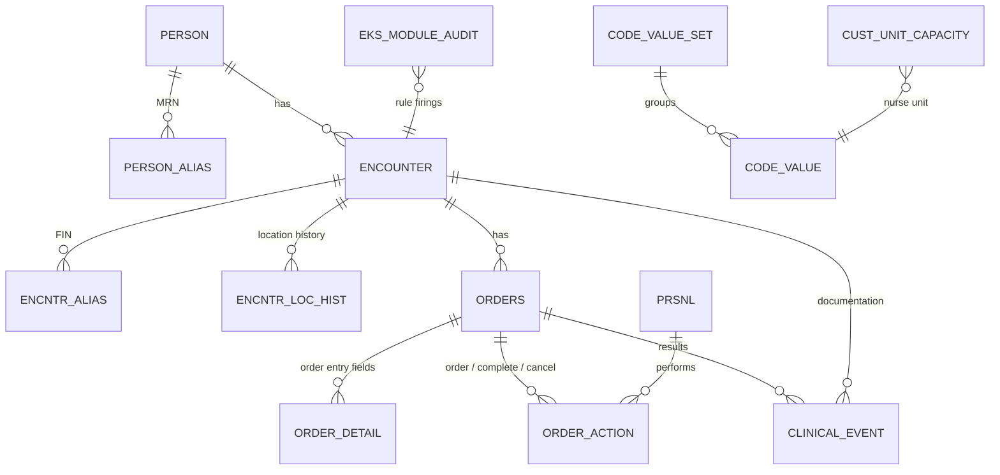

# Data model

The schema in [`sql/schema.sql`](../sql/schema.sql) uses Millennium's table and column names, so the SQL reads the same way it would against a real domain. It's a cut-down version: Millennium's tables have many more columns than I needed, and real sites add their own custom tables on top.

## Tables

| Table | One row per | Used for |
|---|---|---|
| CODE_VALUE, CODE_VALUE_SET | coded value | Decoding every `*_cd` column. |
| PERSON, PERSON_ALIAS | patient, MRN | Demographics, and screening out test patients. |
| ENCOUNTER, ENCNTR_ALIAS | visit, FIN | Encounter type, facility, arrival / admit / discharge times, disposition. |
| ENCNTR_LOC_HIST | stay in one location | ED length of stay, boarding, census, and where a patient was at a given moment. |
| ORDERS, ORDER_DETAIL, ORDER_ACTION | order, order-entry field, action | Status, orderable, priority, and who did what and when. |
| CLINICAL_EVENT | version of a result | Lab results with normal and critical flags, plus nursing documentation such as the critical-result call. |
| PRSNL | staff member | Ordering provider, nurse, lab tech. |
| CUST_UNIT_CAPACITY | nurse unit | Staffed beds. This is a custom table, the kind a site maintains itself. |
| EKS_MODULE_AUDIT | rule firing | Written by the Discern rule simulator. |

## Code sets I used

| Code set | What it holds | Values (cdf_meaning) |
|---|---|---|
| 4 | Person alias type | MRN |
| 8 | Result status | AUTH, MODIFIED, INERROR |
| 19 | Discharge disposition | HOME, HOMEHEALTH, SNF, AMA, EXPIRED, LWBS |
| 52 | Normalcy | NORMAL, HIGH, LOW, CRITICAL |
| 71 | Encounter type | EMERGENCY, INPATIENT, OUTPATIENT |
| 72 | Event code | WBC, Hemoglobin, Potassium, Sodium, Troponin I, Lactate, Critical Result Notification |
| 200 | Order catalog | CBC, Basic Metabolic Panel, Troponin I, Lactate |
| 220 | Location | FACILITY, NURSEUNIT, AMBULATORY |
| 319 | Encounter alias type | FIN NBR |
| 6000 | Catalog type | GENERAL LAB |
| 6003 | Order action type | ORDER, COMPLETE, CANCEL |
| 6004 | Order status | ORDERED, COMPLETED, CANCELED |

## Rules I follow in every report

Most of these I learned by getting them wrong first.

1. **Only use the current version of a result.** When a result is corrected, Millennium doesn't overwrite it. It closes the old row by setting `valid_until_dt_tm` to the correction time and inserts a new row with the same `event_id`. The current row has `valid_until_dt_tm` set to 31-Dec-2100. Forget this filter and every corrected result is counted twice. That was the second bug in [rca.md](rca.md).
2. **Leave out results marked In Error.**
3. **Filter on `active_ind = 1`.** A cancelled registration stays in the encounter table; it's just flagged inactive.
4. **Leave out test patients.** Every build has fake patients that people use for testing. In this data their last name starts with ZZTEST.
5. **Count ED visits by ED arrival, not by encounter type.** When an ED patient is admitted, their encounter type changes to Inpatient on the same `encntr_id`. Filtering on Emergency loses all of them. That was the first bug in [rca.md](rca.md).
6. **Use location history to find where someone was.** `ENCOUNTER.loc_nurse_unit_cd` only holds the last unit. To find the unit at a specific time, join to ENCNTR_LOC_HIST where `beg_effective_dt_tm <= t < end_effective_dt_tm`.
7. **Look codes up by meaning, never by number.** The numeric `code_value` is different in every domain. In SQL I join CODE_VALUE on `code_set` and `cdf_meaning`. In CCL I call `uar_get_code_by("MEANING", ...)` once at the top of the program.
8. **Remember that `result_val` is text.** It has to be converted before any numeric comparison, and one of the data-quality checks makes sure it always can be.
9. **Watch for open-ended dates.** "Still here" is stored as a far-future date on ENCNTR_LOC_HIST and CLINICAL_EVENT, but as a NULL discharge date on ENCOUNTER.
