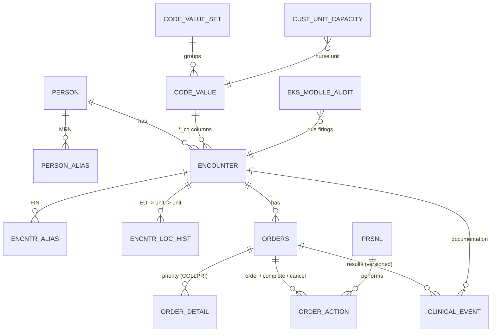

# Data model: Millennium-style tables used by the reports

The schema ([`sql/schema.sql`](../sql/schema.sql)) uses Cerner Millennium's table and column names. It is simplified: the real tables have many more columns, and real sites add their own custom tables. Everything here is synthetic.

| Table | Grain | Used for |
|---|---|---|
| `CODE_VALUE` / `CODE_VALUE_SET` | one coded value | Every `*_cd` column. Join by `code_set` + `cdf_meaning` (or `uar_get_code_by` in CCL). Never hard-code the numeric `code_value`: it differs between domains. |
| `PERSON`, `PERSON_ALIAS` | patient; MRN | `name_last_key` is used to exclude test patients. MRN is `person_alias_type_cd` = MRN (code set 4). |
| `ENCOUNTER`, `ENCNTR_ALIAS` | visit; FIN | Type (71), facility (220), arrival / registration / inpatient admit / discharge times, disposition (19). FIN is code set 319. |
| `ENCNTR_LOC_HIST` | one location segment | Where the patient was and when: ED length of stay, boarding, midnight census, and the unit at the time of a result. |
| `ORDERS`, `ORDER_DETAIL`, `ORDER_ACTION` | order; order-entry field; action | Status (6004), orderable (200). **Priority is an order-entry field** (`oe_field_meaning = 'COLLPRI'`), not an ORDERS column. |
| `CLINICAL_EVENT` | one *version* of a result or documented value | Lab results (with normal/critical flags), plus nurse documentation such as "Critical Result Notification". |
| `PRSNL` | provider / staff | Ordering provider, nurse, lab tech. |
| `CUST_UNIT_CAPACITY` | nurse unit | Site-maintained staffed beds (custom table, not Millennium). |
| `EKS_MODULE_AUDIT` | rule firing | Written by the Discern rule simulator (silent mode). |

## Code sets used

| Code set | Meaning | Values used here (cdf_meaning) |
|---|---|---|
| 4 | Person alias type | MRN |
| 8 | Result status | AUTH, MODIFIED, INERROR |
| 19 | Discharge disposition | HOME, HOMEHEALTH, SNF, AMA, EXPIRED, LWBS |
| 52 | Normalcy | NORMAL, HIGH, LOW, CRITICAL |
| 71 | Encounter type | EMERGENCY, INPATIENT, OUTPATIENT |
| 72 | Event code | WBC, Hemoglobin, Potassium, Sodium, Troponin I, Lactate, Critical Result Notification |
| 200 | Order catalog | CBC, Basic Metabolic Panel, Troponin I, Lactate |
| 220 | Location | FACILITY, NURSEUNIT, AMBULATORY |
| 319 | Encounter alias type | FIN NBR |
| 6000 / 6003 / 6004 | Catalog type / order action / order status | GENERAL LAB / ORDER, COMPLETE, CANCEL / ORDERED, COMPLETED, CANCELED |

## Rules every report follows (and why)

1. **Current version only on CLINICAL_EVENT.** A correction ends the old row (`valid_until_dt_tm` = correction time) and inserts a new row with the same `event_id`. Current rows have `valid_until_dt_tm` = 31-Dec-2100. Without this filter a corrected result counts twice. That is [RCA incident 2](rca.md).
2. **Exclude In Error results** (`result_status_cd` = INERROR).
3. **`active_ind = 1`** on encounters, aliases and location rows. Cancelled registrations stay in the table with `active_ind = 0`.
4. **Exclude test patients.** Every build has fake patients for testing; here they are `name_last_key LIKE 'ZZTEST%'`.
5. **An ED visit is defined by ED arrival, not by `encntr_type_cd`.** When an ED patient is admitted, Millennium changes the same encounter's type to Inpatient. Qualifying on type = Emergency silently drops every admitted ED visit. That is [RCA incident 1](rca.md).
6. **Point-in-time joins for location.** A patient's unit at a given moment comes from `ENCNTR_LOC_HIST` where `beg <= t < end`. `ENCOUNTER.loc_nurse_unit_cd` only holds the *last* unit.
7. **Join codes by meaning.** Use `cdf_meaning`, or `display_key` for event codes. In CCL, use `uar_get_code_by("MEANING", set, "X")` once in a `declare`, not a CODE_VALUE join in every query.
8. **`result_val` is text.** Convert it (`CAST` / `cnvtreal`) before any numeric comparison. DQ check `lab_result_not_numeric` guards this.
9. **Open-ended dates.** "Still here" is a far-future date, not NULL, on `ENCNTR_LOC_HIST` and `CLINICAL_EVENT`. ENCOUNTER uses NULL `disch_dt_tm` for in-house patients.
